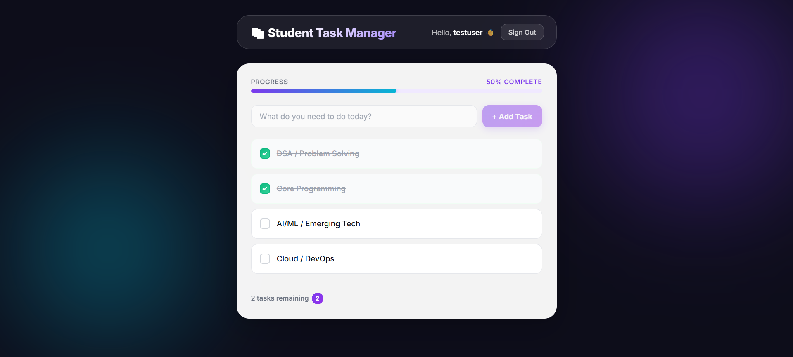
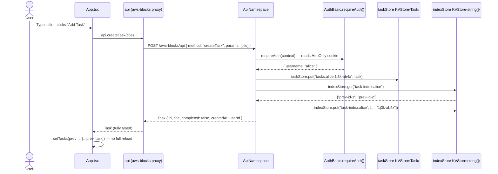

<div align="center">

# 📚 Student Task Manager

**A beginner-friendly full-stack task management app**
built with React 18, TypeScript, and AWS Blocks —
runs entirely on your laptop with zero AWS setup required.

<br/>

[](https://nodejs.org/)
[](https://react.dev/)
[](https://www.typescriptlang.org/)
[](https://vitejs.dev/)
[](https://www.npmjs.com/package/@aws-blocks/blocks)

<br/>

> Sign up · Sign in · Create · Edit · Complete · Delete — all in one page, all per-user isolated.

</div>

---

## 🖥️ App Preview

<p align="center">
  
</p>

---

## ✨ Features

| # | Feature | What it does |
|---|---|---|
| 🔐 | **Sign Up** | Create an account — username + password (min 8 chars), signed in immediately |
| 🔑 | **Sign In** | Authenticate and restore your session from any page refresh |
| 🚪 | **Sign Out** | End the session and return to the auth screen |
| ➕ | **Create Task** | Type a title and press Enter or click "Add Task" |
| 📋 | **View Tasks** | Only your tasks are shown — strict per-user isolation enforced in the backend |
| ✏️ | **Edit Task** | Click "Edit" to update a task's title inline — Save or press Escape to cancel |
| ☑️ | **Complete / Incomplete** | Toggle the checkbox to flip a task's `completed` status |
| 🗑️ | **Delete Task** | Remove a task permanently |
| 🔢 | **Task Counter** | Shows how many tasks are still incomplete at a glance |
| ⏳ | **Loading State** | "Loading your tasks…" while the first fetch is in flight |
| 🫙 | **Empty State** | A friendly prompt when you have no tasks yet |
| ⚠️ | **Error State** | An error banner with a Retry button if any API call fails |
| 📱 | **Responsive** | Clean layout on desktop and mobile |

---

## 🚀 Quick Start

```bash
# 1. Clone the repository
git clone https://github.com/your-username/student-task-manager.git
cd student-task-manager

# 2. Install dependencies
npm install

# 3. Start the local development server (no AWS account needed)
npm run dev
```

Open **http://localhost:3000** in your browser, sign up, and start adding tasks.

> **Tip:** Local data (tasks + user accounts) is persisted to `.bb-data/` on disk.
> Delete that directory to reset everything and start fresh.

---

## 🛠️ Tech Stack

| Layer | Technology | Version |
|---|---|---|
| **Frontend** | React + TypeScript | 18.3.1 / 5.x |
| **Styling** | Pure CSS — responsive, accessible | — |
| **Build Tool** | Vite + `@vitejs/plugin-react` | 6.x / 4.3.4 |
| **Backend** | AWS Blocks `ApiNamespace` | * |
| **Auth** | AWS Blocks `AuthBasic` | * |
| **Storage** | AWS Blocks `KVStore` | * |
| **Runtime** | Node.js + tsx | ≥22.0.0 / 4.x |

---

## 📁 Project Structure

```
student-task-manager/
│
├── aws-blocks/
│   ├── index.ts              # 🔧 Backend — AuthBasic, KVStore, ApiNamespace
│   ├── index.cdk.ts          # ☁️  CDK stack (AWS deploy)
│   ├── index.handler.ts      # λ  Lambda handler (AWS deploy)
│   ├── package.json          # aws-blocks workspace config
│   └── scripts/
│       ├── server.ts         # Local dev server entry point
│       ├── sandbox.ts        # Deploy to AWS sandbox
│       ├── sandbox-destroy.ts
│       ├── deploy.ts         # Production deploy
│       ├── destroy.ts
│       ├── cleanup.ts
│       └── console.ts
│
├── src/
│   ├── index.tsx             # ⚛️  React root — auth gate, session check
│   ├── AuthPanel.tsx         # 🔐 Sign up / sign in form
│   ├── App.tsx               # 📋 Task list — create, edit, toggle, delete
│   └── app.css               # 🎨 All application styles
│
├── test/
│   └── e2e.test.ts           # 🧪 9 end-to-end tests via the typed API client
│
├── index.html                # HTML shell (React mounts at #root)
├── vite.config.ts            # Vite config + React plugin
├── tsconfig.json             # TypeScript — ES2022, react-jsx, strict
├── package.json              # Dependencies + npm scripts
└── cdk.json                  # CDK configuration
```

---

## 🏗️ Architecture

### How the pieces connect

```
┌─────────────────────────────────────────────────────────────┐
│                     Browser (React + TypeScript)            │
│                                                             │
│  src/index.tsx  →  src/AuthPanel.tsx  (sign up / sign in)  │
│       │         →  src/App.tsx        (task CRUD UI)        │
│       │                                                     │
│  import { api, authApi } from 'aws-blocks'                  │
│  (typed proxy — no manual fetch, no REST routes to write)   │
└──────────────────────┬──────────────────────────────────────┘
                       │ JSON-RPC  POST /aws-blocks/api
┌──────────────────────▼──────────────────────────────────────┐
│              AWS Blocks Dev Server  (npm run dev)           │
│                                                             │
│  ┌─────────────┐   ┌───────────────────────────────────┐   │
│  │  AuthBasic  │   │          ApiNamespace             │   │
│  │             │   │  createTask  · listTasks          │   │
│  │  requireAuth│   │  updateTask  · toggleTask         │   │
│  │  createApi  │   │  deleteTask                       │   │
│  └─────────────┘   └──────────────┬────────────────────┘   │
│                                   │                         │
│  ┌────────────────────────────────▼────────────────────┐   │
│  │                    KVStore                          │   │
│  │  taskStore   →  tasks:<userId>:<taskId>  (Task)     │   │
│  │  indexStore  →  task-index:<userId>      (string[]) │   │
│  └─────────────────────────────────────────────────────┘   │
│  Local: data written to .bb-data/ · AWS: DynamoDB           │
└─────────────────────────────────────────────────────────────┘
```

### Component table

| Component | File | Purpose |
|---|---|---|
| **Root** | `src/index.tsx` | Checks session on mount, gates between AuthPanel and App |
| **AuthPanel** | `src/AuthPanel.tsx` | Sign up and sign in via the AuthBasic state machine |
| **App** | `src/App.tsx` | Task list with full CRUD — uses `api` from `aws-blocks` |
| **AuthBasic** | `aws-blocks/index.ts` | Username/password auth, `HttpOnly` JWT session cookie, 8-char min |
| **ApiNamespace** | `aws-blocks/index.ts` | Five typed RPC methods exposed to the frontend |
| **KVStore ×2** | `aws-blocks/index.ts` | `taskStore` for Task objects, `indexStore` for ordered ID lists |

---

## 🔄 Full-Stack Data Flow

Every user action follows the same path. Here it is for **Create Task** — the most write-heavy operation:



**In plain English:**

1. User submits the form — `App.tsx` calls `api.createTask(title)`.
2. The AWS Blocks client proxy sends a single JSON-RPC `POST` to `/aws-blocks/api`.
3. `ApiNamespace` receives the call and immediately calls `auth.requireAuth(context)`.
4. `requireAuth` reads the `HttpOnly` session cookie — throws 401 if missing or expired.
5. A unique task ID is generated (`Date.now().toString(36) + random`), a `Task` object is built.
6. `taskStore.put(...)` writes the full task to `tasks:alice:<taskId>`.
7. `indexStore` is read, the new ID is appended, and the updated list is written back.
8. The `Task` is returned to the frontend as a typed object.
9. React appends it to local state — the UI updates instantly, no re-fetch needed.

---

## ⚙️ Backend API Reference

All methods live in `aws-blocks/index.ts` inside the `ApiNamespace`. Every single one calls `auth.requireAuth(context)` first.

| Method | Signature | Returns | What it does |
|---|---|---|---|
| `listTasks` | `() → Task[]` | All tasks for the signed-in user | Reads ID list from `indexStore`, fetches each `Task` from `taskStore` in order |
| `createTask` | `(title: string) → Task` | The new task | Writes task to `taskStore`, appends ID to `indexStore` |
| `updateTask` | `(taskId, title) → Task` | The updated task | Reads task, verifies ownership, writes new title back |
| `toggleTask` | `(taskId) → Task` | The updated task | Reads task, verifies ownership, flips `completed`, writes back |
| `deleteTask` | `(taskId) → { success }` | `{ success: true }` | Deletes from `taskStore`, removes ID from `indexStore` |

### Task data shape

```typescript
type Task = {
  id:        string;   // "1j3k-ab4x"  — timestamp(base36) + random suffix
  title:     string;   // trimmed on write
  completed: boolean;  // always false on create
  createdAt: number;   // Date.now() — Unix ms timestamp
  userId:    string;   // username of the owner, from auth.requireAuth()
};
```

---

## 🔒 Security & User Isolation

Three independent layers prevent any user from touching another user's data.

### 1 — Every method requires authentication

```typescript
const user = await auth.requireAuth(context);
// ↑ throws SessionExpiredException (401) if no valid cookie
```

### 2 — KVStore keys are scoped to the authenticated userId

```
taskStore:   tasks:<userId>:<taskId>   →  Task object
indexStore:  task-index:<userId>       →  string[] of taskIds
```

`listTasks` only ever reads keys with the *session* `userId` as the prefix — it is structurally impossible to read another user's tasks.

### 3 — Ownership is double-checked on every mutation

```typescript
const task = await taskStore.get(taskKey(user.username, taskId));
if (!task) throw new Error('Task not found');
if (task.userId !== user.username) throw new Error('Forbidden');
```

Even if a task key was somehow guessed, the `task.userId !== user.username` check rejects the request before any write occurs.

---

## 🔐 Authentication Flow

Auth uses the `AuthBasic` state machine via `authApi` (the typed proxy for `auth.createApi()`).

```
── Sign Up ────────────────────────────────────────────────────
AuthPanel calls:
  setAuthState({ action: 'signUp', username, password })
    → state === 'signedIn'  ✓  (immediate — no email verification)
    → state !== 'signedIn'  → follow up with signIn action

── Sign In ────────────────────────────────────────────────────
  setAuthState({ action: 'signIn', username, password })
    → state === 'signedIn'  ✓  session cookie set (HttpOnly)
    → state !== 'signedIn'  → show error from result.error

── Session Check on Page Load (src/index.tsx) ─────────────────
  getAuthState()
    → state === 'signedIn'  → render App  (task manager)
    → otherwise             → render AuthPanel

── Sign Out ───────────────────────────────────────────────────
  setAuthState({ action: 'signOut' })
    → cookie cleared → render AuthPanel
```

Password policy (configured in `aws-blocks/index.ts`): minimum length **8 characters**.

---

## 💾 KVStore Design

Two separate typed `KVStore` instances back all task storage:

```typescript
// Task objects — one entry per task
const taskStore  = new KVStore<Task>(scope, 'todos', {});
//   key pattern:  tasks:<userId>:<taskId>

// Per-user ordered list of task IDs
const indexStore = new KVStore<string[]>(scope, 'todos-index', {});
//   key pattern:  task-index:<userId>
```

**Why two stores?**
KVStore is a simple key-value map — there are no query or scan operations used here. The `indexStore` acts as a lightweight secondary index: it stores the creation-ordered list of task IDs for each user, so `listTasks` can return tasks in the correct order without scanning all keys.

**Local persistence:**
In development, both stores write JSON to `.bb-data/todos/` and `.bb-data/todos-index/`. Data survives server restarts. Delete `.bb-data/` to reset.

---

## 🧪 End-to-End Tests

`test/e2e.test.ts` calls the API through the same typed proxy the frontend uses — no browser, no mocking, no HTTP client setup.

```
✔  auth: starts signed out                        (187ms)
✔  auth: sign up creates account and signs in     (980ms)
✔  auth: unauthenticated access is rejected       (530ms)
✔  tasks: create a task                           ( 24ms)
✔  tasks: list returns only own tasks             ( 10ms)
✔  tasks: update task title                       ( 16ms)
✔  tasks: toggle completion                       ( 20ms)
✔  tasks: delete a task                           ( 30ms)
✔  tasks: tasks persist across list calls         ( 23ms)

  9 tests · 0 failures · ~1.9s total
```

Run them:

```bash
# The runner starts a dev server automatically if one isn't running.
# For faster iteration, start the server first in a separate terminal.

npm run dev        # terminal 1
npm run test:e2e   # terminal 2
```

---

## 📜 Available Scripts

| Script | Description |
|---|---|
| `npm run dev` | Start the local dev server — backend + Vite frontend at **http://localhost:3000** |
| `npm run dev:server` | Start the backend server only (same as `dev`) |
| `npm run build` | Type-check + Vite production build → `dist/` |
| `npm run preview` | Serve the production build locally |
| `npm run typecheck` | TypeScript type check without emitting files |
| `npm run test:e2e` | Run the 9 end-to-end API tests |
| `npm run sandbox` | Deploy to a real AWS sandbox environment |
| `npm run sandbox:destroy` | Tear down the AWS sandbox stack |
| `npm run deploy` | Full production deploy to AWS |
| `npm run destroy` | Tear down the production AWS stack |
| `npm run cleanup` | Clean up local build artefacts |

---

## ☁️ Deploying to AWS

The **same** `aws-blocks/index.ts` backend code that runs locally deploys to AWS unchanged. Blocks swap the local mocks for real AWS services automatically.

```bash
# Prerequisite: AWS credentials configured + CDK bootstrapped
aws configure
npx cdk bootstrap

# Deploy a personal sandbox (real DynamoDB, real auth, real API Gateway)
npm run sandbox

# Tear it down when you're done
npm run sandbox:destroy

# Full production deploy (includes CloudFront + S3 hosting for the frontend)
npm run deploy
```

| Environment | Auth | Storage | Frontend |
|---|---|---|---|
| `npm run dev` | Local JWT mock | `.bb-data/` on disk | Vite dev server |
| `npm run sandbox` | DynamoDB-backed JWTs | Amazon DynamoDB | API Gateway |
| `npm run deploy` | DynamoDB-backed JWTs | Amazon DynamoDB | CloudFront + S3 |

---

## 🤝 Contributing

1. Fork the repository
2. Create a feature branch — `git checkout -b feature/my-feature`
3. Commit your changes — `git commit -m "feat: describe what changed"`
4. Push and open a Pull Request

---

<div align="center">

Built with ❤️ using [AWS Blocks](https://www.npmjs.com/package/@aws-blocks/blocks) · [React](https://react.dev/) · [TypeScript](https://www.typescriptlang.org/) · [Vite](https://vitejs.dev/)

</div>
