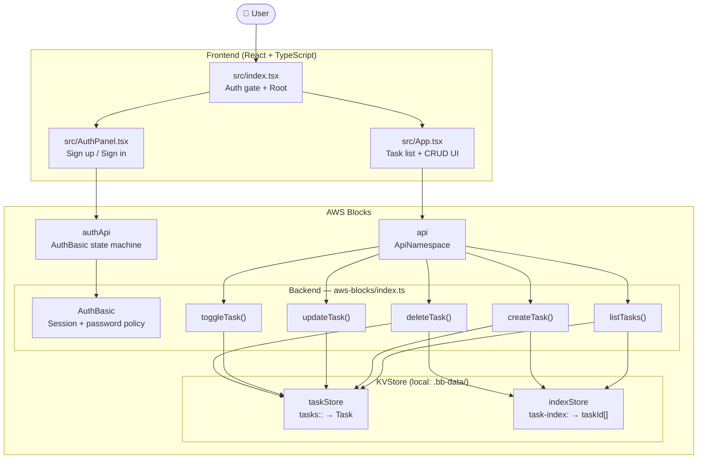
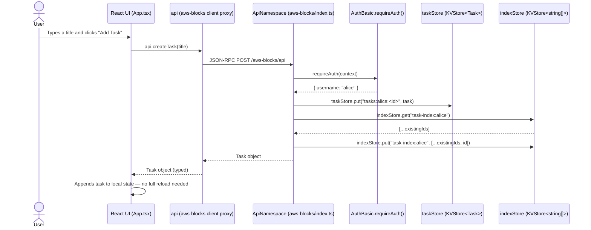
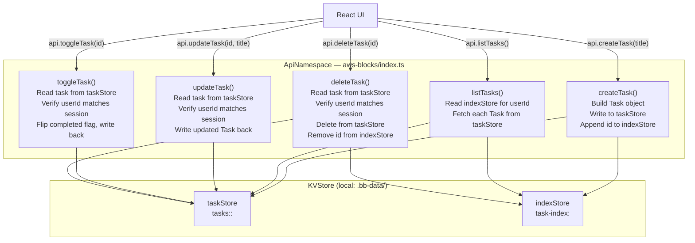

# 📚 Student Task Manager

A beginner-friendly full-stack task management application built with **React**, **TypeScript**, and **AWS Blocks**. Students can sign up, sign in, and manage their own personal task list — create, edit, complete, and delete tasks — with all data persisted per user and all operations protected by authentication.

The application runs entirely on your local machine with no AWS account needed. AWS Blocks provides local mock implementations of every backend service so the development experience is identical to production.

---

## Key Features

| Feature | Description |
|---|---|
| Sign Up | Create a new account with a username and password (minimum 8 characters) |
| Sign In | Authenticate with an existing account |
| Sign Out | End the current session |
| Create Task | Add a new task by entering a title and clicking "Add Task" |
| View Tasks | See only your own tasks, listed in the order they were created |
| Edit Task | Click "Edit" on any task to update its title in place |
| Complete / Incomplete | Check or uncheck the checkbox on a task to toggle its completion status |
| Delete Task | Click "Delete" to permanently remove a task |
| Task Summary | A counter at the bottom shows how many tasks are still incomplete |
| Loading State | A loading message is shown while tasks are being fetched |
| Empty State | A prompt is shown when the user has no tasks yet |
| Error State | An error banner with a "Retry" button is shown if an API call fails |

---

## Project Structure

```
student-task-manager/
├── aws-blocks/
│   ├── index.ts           # Backend — AuthBasic, KVStore, ApiNamespace
│   ├── index.cdk.ts       # CDK stack definition (for AWS deploy)
│   ├── index.handler.ts   # Lambda handler entry point (for AWS deploy)
│   ├── package.json       # aws-blocks workspace package
│   └── scripts/
│       ├── server.ts      # Local dev server startup
│       ├── sandbox.ts     # Deploy to AWS sandbox
│       ├── sandbox-destroy.ts
│       ├── deploy.ts      # Production deploy
│       ├── destroy.ts
│       ├── cleanup.ts
│       └── console.ts
├── src/
│   ├── index.tsx          # React entry point — auth gate, root component
│   ├── AuthPanel.tsx      # Sign up / sign in form
│   ├── App.tsx            # Task list, create/edit/toggle/delete
│   └── app.css            # Application styles
├── test/
│   └── e2e.test.ts        # End-to-end tests using the typed API client
├── index.html             # HTML entry point (React root mount)
├── vite.config.ts         # Vite + React plugin config
├── tsconfig.json          # TypeScript config (target ES2022, jsx react-jsx)
├── package.json           # Project dependencies and npm scripts
└── cdk.json               # CDK configuration
```

---

## High-Level Architecture



### Component Summary

| Component | Purpose |
|---|---|
| **React + TypeScript** | Single-page frontend UI — auth gate, task list, forms |
| **AuthBasic** | Username/password authentication with `HttpOnly` session cookies and a minimum password length of 8 characters |
| **ApiNamespace** | Exposes backend methods (`listTasks`, `createTask`, `updateTask`, `toggleTask`, `deleteTask`) as a type-safe RPC proxy imported directly by the frontend |
| **KVStore** | Key-value storage for task objects and per-user task ID indexes |
| **AWS Blocks** | Framework that wires the above together, runs local mocks during development, and deploys to AWS unchanged |

---

## Full-Stack Data Flow

The following diagram shows what happens when the user creates a new task. All other operations (edit, toggle, delete) follow the same path — only the backend method and KVStore operation differ.



**Step by step:**

1. The user types a task title and submits the form in `App.tsx`.
2. `App.tsx` calls `api.createTask(title)` — `api` is the AWS Blocks typed proxy imported from `aws-blocks`.
3. The proxy sends a JSON-RPC request to `POST http://localhost:3000/aws-blocks/api`.
4. `ApiNamespace` receives the request and calls `auth.requireAuth(context)`, which reads the `HttpOnly` session cookie. If no valid session exists, it throws a 401 and the request is rejected.
5. The backend generates a unique task ID and builds the `Task` object (`id`, `title`, `completed: false`, `createdAt`, `userId`).
6. `taskStore.put(...)` writes the full task object to KVStore under the key `tasks:<userId>:<taskId>`.
7. `indexStore` is read to get the user's current list of task IDs, the new ID is appended, and the updated list is written back.
8. The new `Task` object is returned to the frontend.
9. `App.tsx` appends the task to its local React state — the UI updates immediately without re-fetching the full list.

---

## CRUD Workflows



### How each operation works in the backend

**Create** (`createTask(title: string) → Task`)
- Requires an authenticated session.
- Generates a unique ID from the current timestamp and a random suffix.
- Writes the full `Task` object to `taskStore` at key `tasks:<userId>:<taskId>`.
- Reads the user's task ID list from `indexStore`, appends the new ID, and writes the list back.
- Returns the new `Task` to the frontend.

**Read** (`listTasks() → Task[]`)
- Requires an authenticated session.
- Reads the user's ordered task ID list from `indexStore` at key `task-index:<userId>`. Returns an empty array if none exists.
- For each ID, fetches the full `Task` object from `taskStore`.
- Returns the tasks in the same order as the index (creation order).

**Update** (`updateTask(taskId: string, title: string) → Task`)
- Requires an authenticated session.
- Reads the existing task from `taskStore`.
- Verifies the stored `task.userId` matches the authenticated user (returns `Forbidden` if not).
- Writes the updated task (new title, all other fields unchanged) back to `taskStore`.
- Returns the updated `Task`.

**Toggle** (`toggleTask(taskId: string) → Task`)
- Requires an authenticated session.
- Reads the existing task from `taskStore`.
- Verifies ownership.
- Flips the `completed` boolean and writes the updated task back.
- Returns the updated `Task`.

**Delete** (`deleteTask(taskId: string) → { success: boolean }`)
- Requires an authenticated session.
- Reads the existing task from `taskStore` and verifies ownership.
- Deletes the task object from `taskStore`.
- Reads the user's task ID list from `indexStore`, removes the deleted ID, and writes the list back.
- Returns `{ success: true }`.

---

## User-Scoped Data & Security

Every task is owned by exactly one user. This is enforced at two independent levels in `aws-blocks/index.ts`:

**1. KVStore key scoping**

All task keys include the authenticated user's username:

```
tasks:<userId>:<taskId>    →  Task object
task-index:<userId>        →  string[] of task IDs
```

A user reading `listTasks()` only ever fetches keys prefixed with their own `userId`, so they cannot see another user's tasks.

**2. Ownership check on every mutation**

Every write operation (`updateTask`, `toggleTask`, `deleteTask`) reads the task from the store and explicitly checks:

```typescript
if (task.userId !== user.username) throw new Error('Forbidden');
```

This means that even if someone guessed another user's task key, the check would reject the operation.

**3. `requireAuth` on every method**

Every API method starts with:

```typescript
const user = await auth.requireAuth(context);
```

This reads the `HttpOnly` session cookie set during sign-in. If the cookie is missing, expired, or invalid, the method throws a 401 before any data is accessed.

---

## Task Data Shape

Every task is stored as a JSON object with these fields:

| Field | Type | Description |
|---|---|---|
| `id` | `string` | Unique task identifier (timestamp + random suffix) |
| `title` | `string` | The task title (whitespace-trimmed) |
| `completed` | `boolean` | Whether the task is marked complete |
| `createdAt` | `number` | Unix timestamp (ms) when the task was created |
| `userId` | `string` | The username of the task owner |

---

## Authentication Flow

Authentication is handled by `AuthBasic` from AWS Blocks, configured in `aws-blocks/index.ts`:

```typescript
const auth = new AuthBasic(scope, 'auth', {
  passwordPolicy: { minLength: 8 },
  crossDomain: process.env.BLOCKS_SANDBOX === 'true',
});
export const authApi = auth.createApi();
```

`authApi` is exported and imported by the frontend as a typed proxy. It exposes a state machine driven by `getAuthState()` and `setAuthState()`.

**Sign up flow (in `AuthPanel.tsx`):**

```
setAuthState({ action: 'signUp', username, password })
  → if state !== 'signedIn':
      setAuthState({ action: 'signIn', username, password })
```

Since no `codeDelivery` callback is configured, sign-up is immediate — no email verification step.

**Sign in flow:**

```
setAuthState({ action: 'signIn', username, password })
  → returns AuthState { state: 'signedIn', user: { username } }
```

A signed session cookie is set automatically.

**Session check on page load (in `src/index.tsx`):**

```
getAuthState()
  → state.state === 'signedIn' → show App
  → otherwise                  → show AuthPanel
```

**Sign out:**

```
setAuthState({ action: 'signOut' })
  → clears the session cookie
  → UI returns to AuthPanel
```

---

## Local Development

The application runs fully locally with no AWS account required. AWS Blocks replaces all cloud services with local mock implementations:

- **KVStore** persists data to `.bb-data/` on disk between server restarts.
- **AuthBasic** issues local JWTs instead of using DynamoDB.
- The API is served on `http://localhost:3000/aws-blocks/api`.
- The frontend Vite dev server runs on `http://localhost:3100`.

### Prerequisites

- **Node.js >= 22** — check with `node --version`
- **npm >= 10** — check with `npm --version`

### Install dependencies

```bash
npm install
```

### Start the development server

```bash
npm run dev
```

This starts both the AWS Blocks backend server and the Vite frontend dev server. Open `http://localhost:3000` in your browser.

> To reset all local data (tasks and user accounts), delete the `.bb-data/` directory.

---

## Available npm Scripts

| Script | Command | Description |
|---|---|---|
| `npm run dev` | `tsx watch aws-blocks/scripts/server.ts` | Start the local development server (backend + frontend) |
| `npm run dev:server` | `tsx watch aws-blocks/scripts/server.ts` | Same as `dev` — start the backend server only |
| `npm run build` | `tsc && vite build` | Type-check and build the frontend for production (`dist/`) |
| `npm run preview` | `vite preview` | Preview the production build locally |
| `npm run typecheck` | `tsc --noEmit` | Run TypeScript type checking without emitting files |
| `npm run test:e2e` | `tsx -C browser test/e2e.test.ts` | Run the end-to-end test suite against a running dev server |
| `npm run sandbox` | `tsx aws-blocks/scripts/sandbox.ts` | Deploy to an AWS sandbox environment (requires AWS account) |
| `npm run sandbox:destroy` | `tsx -C cdk aws-blocks/scripts/sandbox-destroy.ts` | Tear down the AWS sandbox stack |
| `npm run deploy` | `tsx aws-blocks/scripts/deploy.ts` | Deploy to production AWS (requires AWS account) |
| `npm run destroy` | `tsx aws-blocks/scripts/destroy.ts` | Tear down the production AWS stack |
| `npm run cleanup` | `tsx aws-blocks/scripts/cleanup.ts` | Clean up local build artefacts |

---

## End-to-End Tests

The test suite in `test/e2e.test.ts` tests the API through the same typed client the frontend uses — no browser, no mocking. It covers:

- Auth starts signed out
- Sign up creates an account and signs in
- Unauthenticated access is rejected
- Create a task
- List tasks (returns only the signed-in user's tasks)
- Update a task title
- Toggle task completion (and toggle back)
- Delete a task
- Tasks persist across multiple `listTasks` calls

Run the tests against a running dev server:

```bash
# Terminal 1 — start the server (skip if already running)
npm run dev

# Terminal 2 — run the tests
npm run test:e2e
```

The test runner will start the dev server automatically if one is not already running.

---

## Technologies

| Technology | Version | Role |
|---|---|---|
| React | 18.3.1 | Frontend UI framework |
| TypeScript | ^5.3.0 | Type safety across frontend and backend |
| AWS Blocks (`@aws-blocks/blocks`) | * | Full-stack framework — auth, storage, API |
| Vite | ^6.4.3 | Frontend build tool and dev server |
| `@vitejs/plugin-react` | 4.3.4 | React JSX transform for Vite |
| `tsx` | ^4.7.0 | TypeScript execution for backend scripts |
| Node.js | >= 22.0.0 | Runtime requirement |
